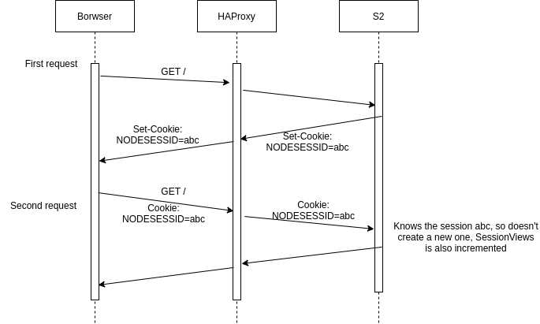
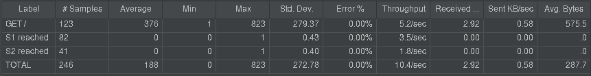
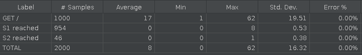
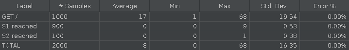
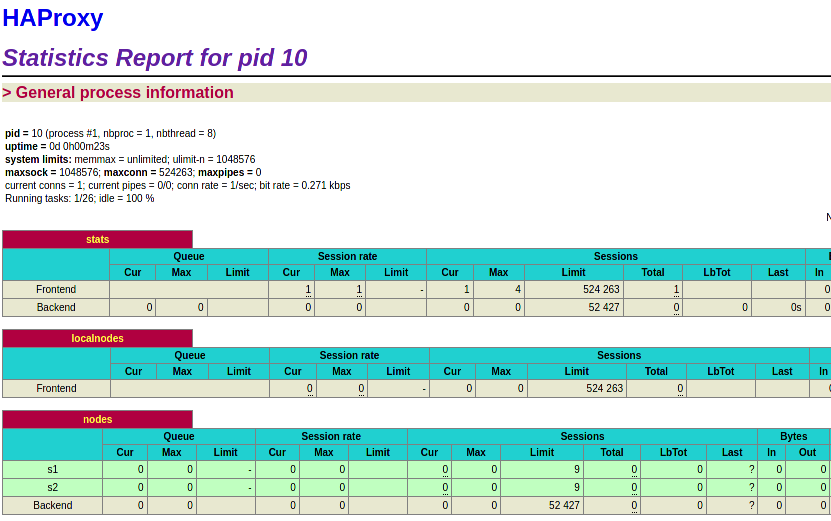
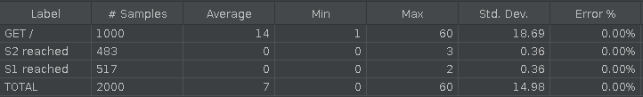
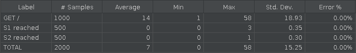
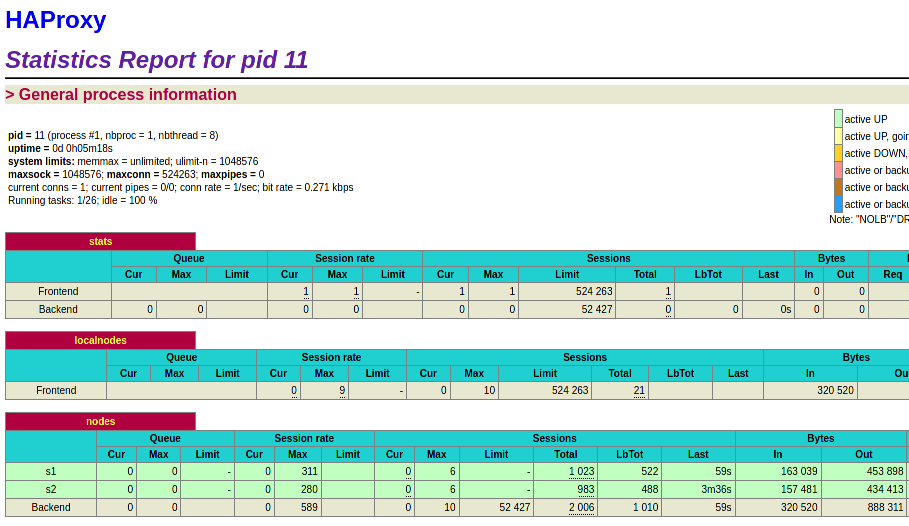

# AIT - Rapport de laboratoire - Load balancing

by Bonzon Tiffany, Scherer Laurent & Thoeny Laurent


### Task 1: Install the tools

After running `docker-compose up --build` we can verify that our containers are started.


We can then verify that we're able to access the load balancer address properly


Then we start the JMeter script and verify that the output is split accordingly


##### 1. Explain how the load balancer behaves when you open and refresh the URL http://192.168.42.42 in your browser. Add screenshots to complement your explanations. We expect that you take a deeper a look at session management.

Using the tag from the response, we can see that the server that respond change every time we make a request. A quick look at load balancing strategies tell us that we're facing a *Round-Robin* load balancer. The screenshots above show that exactly half of the request sent by JMeter were handled by both servers, with that proof and a quick look at the config in `haproxy.cfg` we have confirmed our hypothesis.


Looking at the *NODESESSID* cookie we received, we can see that a new session is established at every connection, this means the session management is stateless, there is no guarantee that the server answering your second query will be the same that answered the first. It can become a problem if we implement stateful services in our servers.

##### 2. Explain what should be the correct behavior of the load balancer for session management.

The load balancer should implement *sticky sessions*, a mechanism that allows the load balancer to know when a connection was established by the client before, allowing the client to be served by the same server again. For example, [Traefik](https://doc.traefik.io/traefik/routing/services/) uses cookies to allow the sticky sessions, the cookie contains the IP address of the server concerned by a connection.

##### 3. Provide a sequence diagram to explain what is happening when one requests the URL for the first time and then refreshes the page. We want to see what is happening with the cookie. We want to see the sequence of messages exchanged (1) between the browser and HAProxy and (2) between HAProxy and the nodes S1 and S2.


Currently, the proxy doesn't take the cookie into consideration, it simply redirects every request on either S1 or S2 according to its round-robin policy. As the browser sends its session ID each time and the request is sent to the other server, the session is recreated by each server each time.

##### 4. Provide a screenshot of the summary report from JMeter.


##### 5. Run the following command `docker stop s1`, clear the results in JMeter and re-run the test plan. Explain what is happening when only one node remains active. Provide another sequence diagram using the same model as the previous one.

This time, when we refresh, we're always on the second server, this allows us to see that the value of `sessionViews` is now incremented, the value of the cookie doesn't change anymore, we've preserved a session with the same server.


You can see the report of the results below, the result is obvious, every request is now directed to the same server.


And below again, you can see the sequence diagram updated to show the situation.



### Task 2: Sticky sessions

##### 1. There is different way to implement the sticky session. One possibility  is to use the SERVERID provided by HAProxy. Another way is to use the NODESESSID provided by the application. Briefly explain the difference  between both approaches (provide a sequence diagram with cookies to show the difference).

The difference is that an application level session ID (`NODESESSID` in this case) might not be understood by the load balancer, also there could be multiple services on a server that don't share the same ID but should be considered as a whole.

We do prefer using the ID at the server level and will go on with an implementation of the `SERVERID` load balancing. Note that the `SERVERID` cookie is only used and set by the proxy.


This time, compared to the first diagram of task#1, the proxy sets the `SERVERID` cookie, and redirects the requests accordingly. A second browser would have its requests redirected to S2 (as seen in the diagram below).

##### 2. Provide the modified `haproxy.cfg` file with a short explanation of the modifications you did to enable sticky session management.
We declare a cookie based on [this documentation](https://cbonte.github.io/haproxy-dconv/2.2/configuration.html#4.2-cookie) and we add the cookie keyword to the server declarations based on [this documentation](https://cbonte.github.io/haproxy-dconv/2.2/configuration.html#5.2-cookie).

```bash
backend nodes
	...
	# Add the cookie, based on the doc quoted on the report
    cookie SERVERID insert indirect nocache

    # Define the list of nodes to be in the balancing mechanism
    # http://cbonte.github.io/haproxy-dconv/2.2/configuration.html#4-server
    server s1 ${WEBAPP_1_IP}:3000 check cookie s1
    server s2 ${WEBAPP_2_IP}:3000 check cookie s2
```

##### 3. Explain what is the behavior when you open and refresh the URL http://192.168.42.42 in your browser. Add screenshots to complement your explanations. We expect that you take a deeper a look at session management.

After restarting both servers and the proxy, we can verify the config from the browser, this time if we refresh the page many time we will see that our connexion has been preserved with the same server and that the `sessionViews` value is incremented once again.


What was happening before is that the application server verified the `NODESESSID` value and assigned a new one if the existing value wasn't recognized. Since we went from server A to server B every time, the value of the `NODESESSID` was changed every time. After that, when we did shutdown a server and connected to the same multiple time in a row, we saw that the session ID allowed Node to increment the variable.

What we implemented now is the second cookie, `SERVERID`, this cookie is created by our proxy when a request is forwarded to a server and contains the name of said server. When we make another request, the proxy checks for an existing cookie, if the cookie exists and contains a valid value (the name of a server that is currently online) then the request will be forwarded accordingly. Otherwise a new cookie is created.

##### 4. Provide a sequence diagram to explain what is happening when one requests the URL for the first time and then refreshes the page. We want to see what is happening with the cookie. We want to see the sequence of messages exchanged (1) between the browser and HAProxy and (2) between HAProxy and the nodes S1 and S2. We also want to see what is happening when a second browser is used.


##### 5. Provide a screenshot of JMeter's summary report. Is there a difference with this run and the run of Task 1?

There is a clear difference, now every request was sent to the same endpoint, it's obviously thanks to the sticky session we implemented.


##### 6. Provide a screenshot of JMeter's summary report. Give a short explanation of what the load balancer is doing.

- Clear the results in JMeter.

- Now, update the JMeter script. Go in the HTTP Cookie Manager and verify that the box `Clear cookies each iteration?` is unchecked.
- Go in `Thread Group` and update the `Number of threads`. Set the value to 2.

We modified the number of threads to be 2.

The first thread was directed toward Server A, the second thread was directed toward Server B thanks to the round robin load balancing, then every request made by each of the threads was sent to the same server as the first they made, thanks to the session stickiness.


 

### Task 3: Drain mode

We did verify our access to the stats panel by going to `http://192.168.42.42:1936/`


##### 1. Take a screenshot of the Step 5 and tell us which node is answering.

The screenshot is available above, we can see that the server `s2` answered our latest query.

##### 2. Based on your previous answer, set the node in DRAIN mode. Take a screenshot of the HAProxy state page.

We did set the corresponding server in drain mode, you can see the commands as well as the state from the proxy panel in the screenshots below.

 


##### 3. Refresh your browser and explain what is happening. Tell us if you stay on the same node or not. If yes, why? If no, why?

Yes, we did stay on the same node, it was the expected behavior since we were already on an established communication with the node. The new traffic, however, will be directed towards the other servers.

##### 4 + 5. Open another browser and open `http://192.168.42.42`. What is happening ? Clear the cookies on the new browser and repeat these two steps multiple times. What is happening? Are you reaching the node in DRAIN mode?

We opened another browser and it connected to `s1` as expected. We did refresh the page a few times after clearing the cookie and also connected from private navigation, every test resulted the same way, a connection was established to `s1`. It means the new traffic can't reach `s2` from the load balancer, as expected.

##### 6. Reset the node in READY mode. Repeat the three previous steps and explain what is happening. Provide a screenshot of HAProxy's stats page.

First we set the server back with `set server nodes/s2 state ready` then we proceeded to the same tests as before, this time every time we established a new connection without a cookie we were redirected toward a new server. Below is the screenshot from the stats panel.


##### 7. Finally, set the node in MAINT mode. Redo the three same steps and explain what is happening. Provide a screenshot of HAProxy's stats page.

We set the server using the same command as above, then tried every step from the previous tests and we couldn't reach a connection with the server `s2`. Then we tried to refresh the page from our original browser (that contains a cookie referring to `s2`) and were connected to `s1` with a new cookie.

Below is a screenshot of the stats from the proxy panel.


At the end of this step we restored the server to its ready state.

### Task 4: Round robin in degraded mode

Adding a delay

```bash
# Gets s1 IP Address
$ docker inspect -f '{{range .NetworkSettings.Networks}}{{.IPAddress}}{{end}}' s1
192.168.42.11
# Adds a 300ms delay
$ curl -H "Content-Type: application/json" -X POST -d '{"delay": 300}' http://192.168.42.11:3000/delay
{"message":"New timeout of 300ms configured."}
```


We can see the effect of the delay on S1 with the JMeter results shown above

##### 1. Make sure a delay of 0 milliseconds is set on `s1`. Do a run to have a baseline to compare with in the next experiments.

Removing the previously added delay

```bash
# Removes previously added delays
$ curl -H "Content-Type: application/json" -X POST -d '{"delay": 0}' http://192.168.42.11:3000/delay
{"message":"New timeout of 0ms configured."}
```


##### 2. Set a delay of 250 milliseconds on `s1`. Relaunch a run with the JMeter script and explain what is happening.

```bash
# Adds a 250ms delay
$ curl -H "Content-Type: application/json" -X POST -d '{"delay": 250}' http://192.168.42.11:3000/delay
{"message":"New timeout of 250ms configured."}
```


We can see that, while S2 still processes around 72 requests per second, S1 handles around 3.4 requests per second, which is approximately 290ms per request.

##### 3. Set a delay of 2500 milliseconds on `s1`. Same than previous step.

```bash
# Adds a 2500ms delay
$ curl -H "Content-Type: application/json" -X POST -d '{"delay": 2500}' http://192.168.42.11:3000/delay
{"message":"New timeout of 2500ms configured."}
```


This time S1 doesn't answer any requests. This is due to the 2.5 seconds delay. We can see that HAProxy considers that S1 is down


##### 4. In the two previous steps, are there any errors? Why?

There aren't any errors shown, as HAProxy detected S1 as DOWN and simply stopped sending requests to it

##### 5. Update the HAProxy configuration to add a weight to your nodes. For that, add `weight [1-256]` where the value of weight is between the two values (inclusive). Set `s1` to 2 and `s2` to 1. Redo a run with a 250ms delay.


After modifying the config and rebuilding the images, we can add the delay to both servers

```bash
$ curl -H "Content-Type: application/json" -X POST -d '{"delay": 250}' http://192.168.42.11:3000/delay
{"message":"New timeout of 250ms configured."}
```


We can see that with cookies and a 250ms delay on S1, weights have virtually no effects

##### 6. Now, what happens when the cookies are cleared between each request and the delay is set to 250ms? We expect just one or two sentence to summarize your observations of the behavior with/without cookies.

For that, we go into JMeter > HTTP Cookie Manager, and check the `Clear cookies each iteration?` checkbox



We can see that S1 handles 2 times more requests that S2 even with the 250ms delay.

- Summary:
  - With cookies
    - As cookies are conserved, the load balancer always sends requests from the same thread to the same server. Here the weights have no effects.
  - Without cookies
    - As configured, S1 will receive 2 times more requests that S2. So S2 will be "slowed" due to its lower weight with the round-robin policy

### Task 5: Balancing strategies

##### 1. Briefly explain the strategies you have chosen and why you have chosen them.

We did choose to compare the strategies `leastconn` and `first` with the `roundrobin` we have already used, our choice is mainly because the two strategies can be seen as "opposites" to each other and have realistic use cases.

##### 2. Provide evidence that you have played with the two strategies (configuration done, screenshots, ...)

First, we did modify our configuration to implement the `first` policy.

```bash
# Set the strategy
balance first

# We keep the sticky session options
cookie SERVERID insert indirect nocache

# maxconn parameter was added for both server
server s1 ${WEBAPP_1_IP}:3000 check cookie s1 maxconn 9
server s2 ${WEBAPP_2_IP}:3000 check cookie s2 maxconn 9
```

Then we used JMeter, we set 10 threads to connect 100 times and asked it to clear cookie at each iteration.



As expected, most of the connections were send to the first server, but around 5% of them were sent to the second one, this happened every time our 10th thread sent a request when the first 9 were already connected.

We then made the same test but without asking JMeter to clear the cookie at each iteration.



This time, as we expected, we can see that the first 9 threads sent 100 request to our first server and stayed connected, therefore the 10th thread connected to our second server and sent its 100 requests to him.



On the screenshot above, you can see that our statistics page shows us the session limit was indeed fixed at 9 for both our nodes.


Now moving on to the second policy, `leastconn`.

```bash
# Set the strategy
balance leastconn

# We keep the sticky session options
cookie SERVERID insert indirect nocache

# maxconn parameter was added for both server
server s1 ${WEBAPP_1_IP}:3000 check cookie s1
server s2 ${WEBAPP_2_IP}:3000 check cookie s2
```

We will run the same JMeter tests as above, 10 users and 100 threads, first while clearing the cookies, then without it.





As we expected, the results are way more balanced this way, exactly 50% when the session is preserved through cookies and a little difference above, probably because 13 more connections were established while one more was still active on the other server. The second screenshot shows that `roundrobin` is correctly implemented when the number of connections is the same on all the servers.

We can verify that by accessing our browser and accessing the page `http://192.168.42.42/` multiples times with cookies disabled, we can see that we're bouncing between our servers.

Finally here is a screenshot of the stats page from this config, we you can see the load balancer kept track of the number of sessions established.



This conclude our analysis of both strategies, our conclusions can be read in the point below.

##### 3. Compare the two strategies and conclude which is the best for this lab (not necessary the best at all).

It's interesting to see that the two strategies have radically different goals and applications, the `first` strategy will put every connection on the first server of the poll until said server has reached it's maximum number of allowed connections, then move onto the second server, etc ... 

This strategy allows to exploit every server to the maximum of its capacity and to adapt the size of the server cluster/poll according to the number of the connections. If you have 10 servers with 1000 max connections during peak hours but a maximum of 1500 connections (during the night, for example) then you could turn off / re-purpose 8 of the servers. It is useful if you have tool that automate the size of your server poll based on the servers activity. This configuration fits better with long sessions (RDP and IMAP are quoted as examples in the documentation)

On the other hand, the `leastConn` strategy will take advantage of every server available to its capacity by always assigning a new connection to the less busy server of the poll (`roundrobin` is used when they are equal), this allows the load to be equally distributed among our servers. This policy is better when used with very long sessions (LDAP and SQL are among the examples quoted in the documentation)  

We don't think any of those two strategies would fit the lab better than the `roundrobin`policy who was used, mostly because the sessions were especially shorts during the tests and examples while the two strategies aforementioned are better for longer ones. However it's important to know about such possibilities when you're about to decide on a load balancer implementation.

