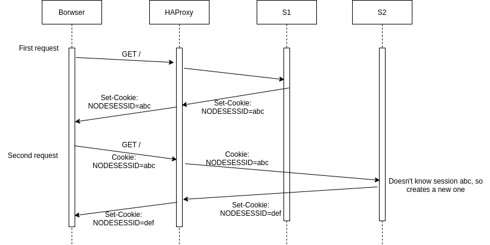

# AIT - Rapport de laboratoire - Load balancing

by Bonzon Tiffany, Scherer Laurent & Thoeny Laurent


### Task 1: Install the tools

After running `docker-compose up --build` we can verify that our containers are started.


We can then verify that we're able to access the load balancer address properly


Then we start the JMeter script and verify that the output is split accordingly


##### 1. Explain how the load balancer behaves when you open and refresh the URL http://192.168.42.42 in your browser. Add screenshots to complement your explanations. We expect that you take a deeper a look at session management.

Using the tag from the response, we can see that the server that respond change every time we make a request. A quick look at load balancing strategies tell us that we're facing a *Round-Robin* load balancer. The screenshots above show that exactly half of the request sent by JMeter were handled by both servers, with that proof and a quick look at the config in `haproxy.cfg` we have confirmed our hypothesis.

Taking a look at the *NODESESSID* cookie we received, we can see that a new session is established at every connection, this means the session management is stateless, there is no guarantee that the server answering your second query will be the same that answered the first. It can become a problem if we implement stateful services in our servers.

##### 2. Explain what should be the correct behavior of the load balancer for session management.

The load balancer should implement *sticky sessions*, a mechanism that allows the load balancer to know when a connection was established by the client before, allowing the client to be served by the same server again. For example, [Traefik](https://doc.traefik.io/traefik/routing/services/) uses cookies to allow the sticky sessions, the cookie contains the IP address of the server concerned by a connection.

##### 3. Provide a sequence diagram to explain what is happening when one requests the URL for the first time and then refreshes the page. We want to see what is happening with the cookie. We want to see the sequence of messages exchanged (1) between the browser and HAProxy and (2) between HAProxy and the nodes S1 and S2.



##### 4. Provide a screenshot of the summary report from JMeter.

The screenshot is available above.

##### 5. Run the following command `docker stop s1`, clear the results in JMeter and re-run the test plan. Explain what is happening when only one node remains active. Provide another sequence diagram using the same model as the previous one.

This time, when we refresh, we're always on the second server, this allows us to see that the value of `sessionViews` is now incremented, the value of the cookie doesn't change anymore, we've preserved a session with the same server.


You can see the report of the results below, the result is obvious, every request is now directed to the same server.


And below again, you can see the sequence diagram updated to show the situation.


### 

### Task 2: Sticky sessions

##### 1. There is different way to implement the sticky session. One possibility  is to use the SERVERID provided by HAProxy. Another way is to use the  NODESESSID provided by the application. Briefly explain the difference  between both approaches (provide a sequence diagram with cookies to show the difference).

The difference is that an application level session ID might not be understood by the load balancer, and that there could be multiple services on a server that don't share the same ID but should be considered as a whole.

We do prefer using the ID at the server level and will go on with an implementation of the `SERVERID` load balancing.


##### 2. Provide the modified `haproxy.cfg` file with a short explanation of the modifications you did to enable sticky session management.

We declare a cookie based on [this documentation](https://cbonte.github.io/haproxy-dconv/2.2/configuration.html#4.2-cookie) and we add the cookie keyword to the server declarations based on [this documentation](https://cbonte.github.io/haproxy-dconv/2.2/configuration.html#5.2-cookie).

```bash
cookie SERVERID insert indirect nocache

server s1 ${WEBAPP_1_IP}:3000 check cookie s1
server s2 ${WEBAPP_2_IP}:3000 check cookie s2
```

##### 3. Explain what is the behavior when you open and refresh the URL http://192.168.42.42 in your browser. Add screenshots to complement your explanations. We expect that you take a deeper a look at session management.

After restarting both servers and the proxy, we can verify the config from the browser, this time if we refresh the page many time we will see that our connexion has been preserved with the same server and that the `sessionViews` value is incremented once again.


What was happening before is that the application server verified the `NODESESSID` value and assigned a new one if the existing value wasn't recognized. Since we went from server A to server B every time, the value of the `NODESESSID` was changed every time. After that, when we did shutdown a server and connected to the same multiple time in a row, we saw that the session ID allowed Node to increment the variable.

What we implemented now is the second cookie, `SERVERID`, this cookie is created by our proxy when a request is forwarded to a server and contains the name of said server. When we make another request, the proxy checks for an existing cookie, if the cookie exists and contains a valid value (the name of a server that is currently online) then the request will be forwarded accordingly. Otherwise a new cookie is created.

##### 4. Provide a sequence diagram to explain what is happening when one requests the URL for the first time and then refreshes the page. We want to see what is happening with the cookie. We want to see the sequence of messages exchanged (1) between the browser and HAProxy and (2) between HAProxy and the nodes S1 and S2. We also want to see what is happening when a second browser is used.


##### 5. Provide a screenshot of JMeter's summary report. Is there a difference with this run and the run of Task 1?

There is a clear difference, now every request was sent to the same endpoint, it's obviously thanks to the sticky session we implemented.


- Clear the results in JMeter.
- Now, update the JMeter script. Go in the HTTP Cookie Manager and verify that the box `Clear cookies each iteration?` is unchecked.
- Go in `Thread Group` and update the `Number of threads`. Set the value to 2.

##### 6. Provide a screenshot of JMeter's summary report. Give a short explanation of what the load balancer is doing.

We modified the number of threads to be 2.

The first thread was directed toward Server A, the second thread was directed toward Server B thanks to the round robin load balancing, then every request made by each of the threads was sent to the same server as the first they made, thanks to the session stickyness.


### 

### Task 3: Drain mode